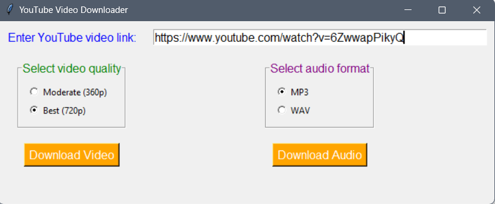

# Youtube-audio-video-downloder

This Python script allows you to download videos and audios from YouTube using the Tkinter graphical user interface. It utilizes the `pytube` library to fetch YouTube video data and download the streams. The downloaded videos can be saved in the selected quality, and there is an option to convert the downloaded video to audio format.

## Prerequisites

Make sure you have the following libraries installed:

- `tkinter`
- `pytube`
- `moviepy`

You can install the required libraries using pip:
```pip install tkinter pytube moviepy```


## Usage

1. Run the script in Python.
2. Enter the YouTube video link in the provided entry field.
3. Select the desired video quality from the available options.
4. (Optional) Select the desired audio format from the available options.
5. Click the "Download Video" button to download the video or the "Download Audio" button to download the audio.
6. Choose the save location for the downloaded file.
7. Wait for the download to complete.
8. The status label will display the progress and status of the download.
9. If audio format conversion is requested, the audio file will be saved separately.

## Code Explanation

The script uses the Tkinter library to create a graphical user interface. It consists of several functions and widgets:

- `download_video()` function: This function is called when the "Download Video" button is clicked. It retrieves the video link from the entry field, prompts the user to select the save path, and then proceeds to download the video in the selected quality. If audio format conversion is requested, it converts the downloaded video to the selected audio format.

- `download_audio()` function: This function is called when the "Download Audio" button is clicked. It retrieves the video link from the entry field, prompts the user to select the save path, and then proceeds to download the audio of the video.

- `link_label`: This is a `Label` widget that displays the text "Enter YouTube video link:".

- `link_entry`: This is an `Entry` widget where the user can enter the YouTube video link.

- `quality_frame`: This is a `LabelFrame` widget that contains the radio buttons for selecting the video quality.

- `audio_frame`: This is a `LabelFrame` widget that contains the radio buttons for selecting the audio format.

- `selected_quality`: This is a `StringVar` variable that stores the selected video quality.

- `selected_audio_format`: This is a `StringVar` variable that stores the selected audio format.

- `status_message`: This is a `StringVar` variable that stores the status message displayed in the status label.

- `quality_options`: This is a list of tuples containing the available video quality options.

- `audio_format_options`: This is a list of tuples containing the available audio format options.

- `video_download_button`: This is a `Button` widget that triggers the `download_video()` function when clicked.

- `audio_download_button`: This is a `Button` widget that triggers the `download_audio()` function when clicked.

- `status_label`: This is a `Label` widget that displays the status message.

## Running the Script

To run the script, execute the following command:

```python your_script_name.py```

Replace `your_script_name.py` with the actual name of your Python script.

## License

This project is licensed under the [MIT License](LICENSE). Feel free to modify and distribute this code as per the license terms.



